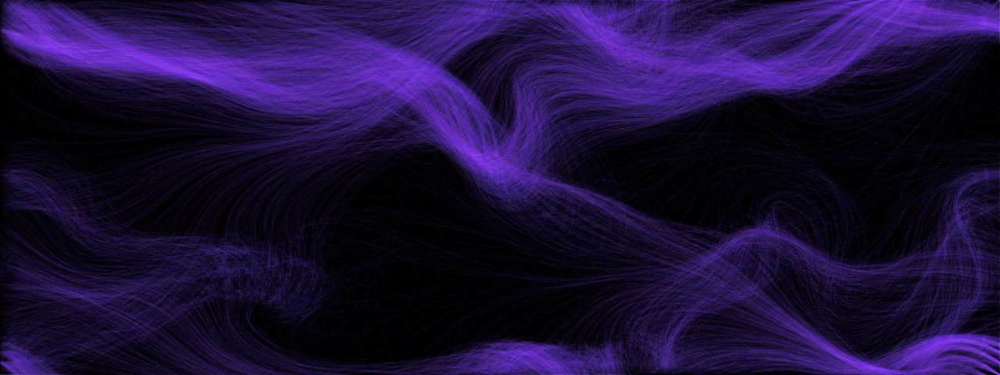
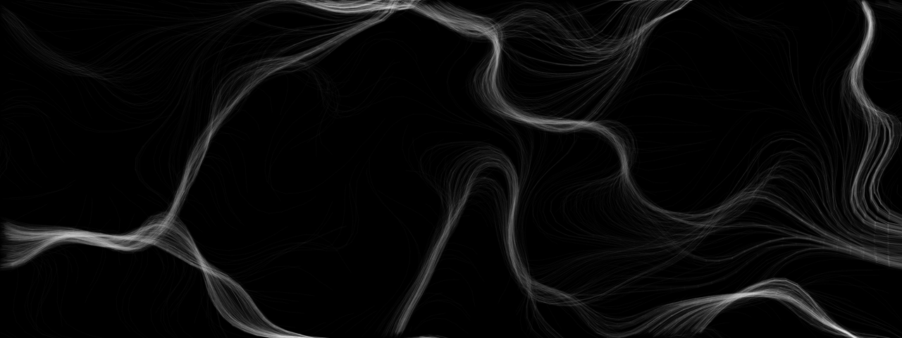

# python-perlin-flow-field

A test of particle simulation in a flow field based on Perlin noise with PyQt5.

Run with: `python main.py`

## Examples
### COLORED_PIPES

### DEBUG_NOISE

### DUST

### ELLIPSES_HSV_ANGLE_SLOW

### ELLIPSES_HUE_CHANGING

### HUE_LENGTH_PIPES

### LINES_HUE_LENGTH

### LINES_HUE_SAT_LENGTH

### LINES_HUE_Y_POS

### LINES_HUE_Y_POS_SAT_LENGTH_LIMITED

### NO_ACC_LINES

### RGB_ELLIPSES_FOREVER

### SHIMMER

### WHITE_PIPES

### WHITE_SCRIBBLES

### WHITE_WEB

